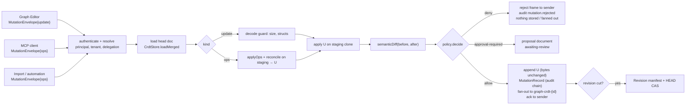
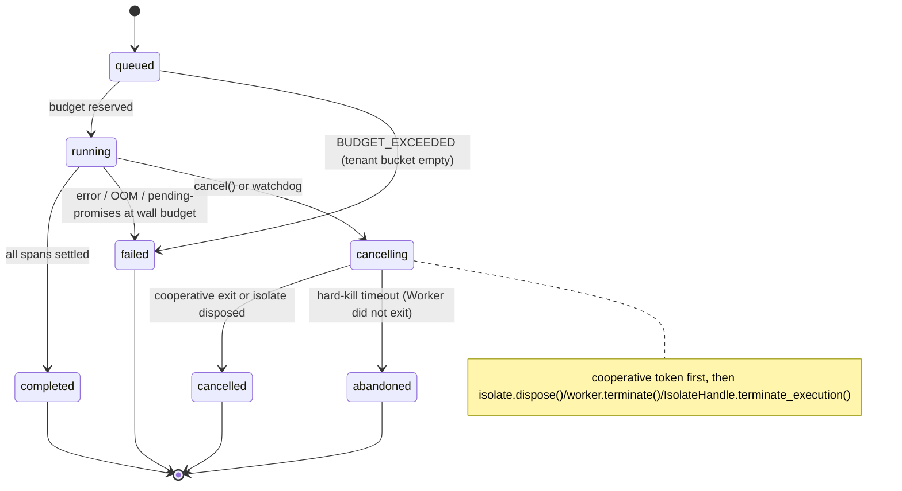
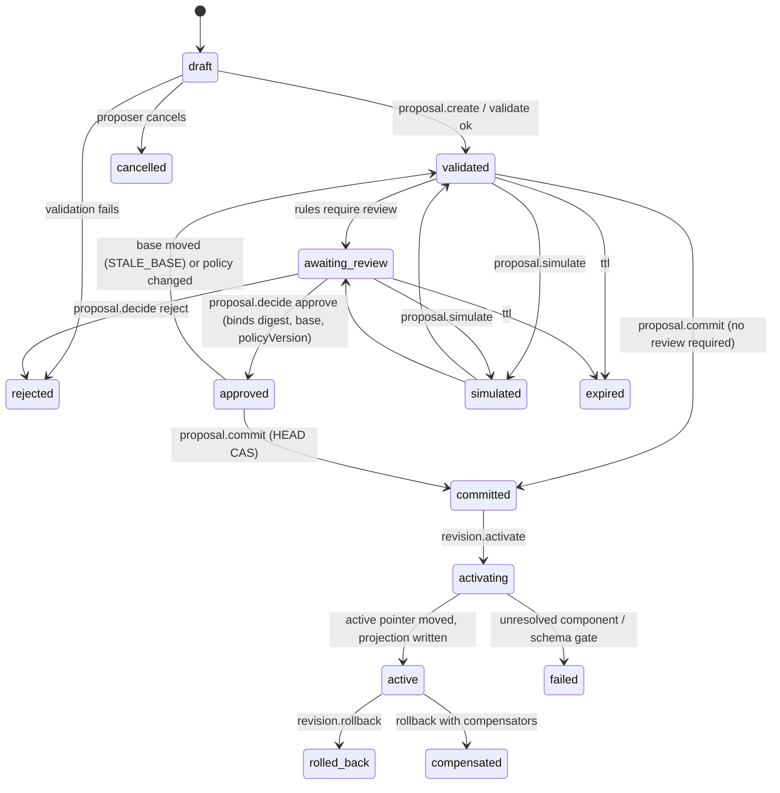
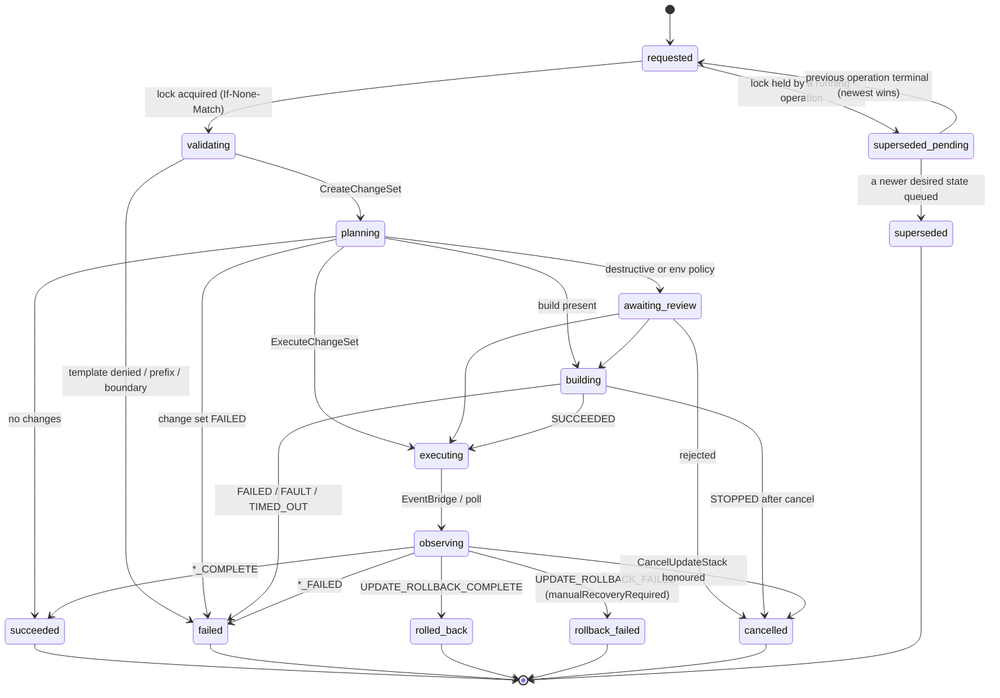
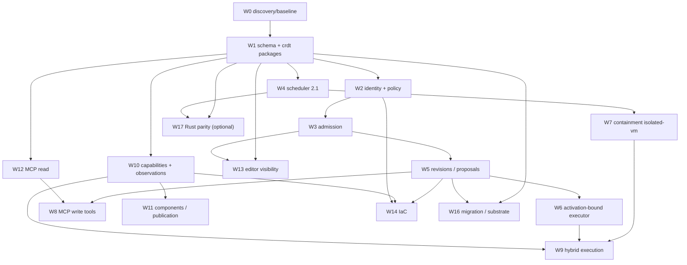

# A10. Diagrams (Mermaid; render on GitHub or any Mermaid-capable viewer)

## A10.1 Admission flow (§4.4.2)


## A10.2 Hybrid execution sequence (trace §6.3)
```mermaid
sequenceDiagram
  autonumber
  participant C as HTTP client
  participant GW as API Gateway (JWT authorizer)
  participant L as Lambda httpDefault
  participant X as isolated-vm executor (rev12)
  participant O as Observation sink / S3
  participant WS as graph-notify-viz channel
  participant B1 as Browser viewer 1
  participant B2 as Browser viewer 2
  C->>GW: POST /viz.in {payload}
  GW->>L: event + principal
  L->>L: endpoints/viz.in → active/viz = rev12; executionId E1; reserve budget
  L->>X: url("in", payload, budget slice)
  X->>O: exec.begin {E1, rev12, http.in}
  X->>X: edges.out = payload (hyperedge c1,c2)
  X->>O: route c1 → price.compute ; effect net:https api.example.com allowed
  X->>O: route c2 → shader.render deferred:browser
  X->>WS: edge.deliver {E1, seq 3, c2, value, target all-viewers}
  WS-->>B1: edge.deliver (dedup key E1/c2/3)
  WS-->>B2: edge.deliver (dedup key E1/c2/3)
  B1->>B1: worker runs shader.render with host.ui
  B2->>B2: worker runs shader.render with host.ui
  B1-->>O: observation.report {E1, domain browser, seq 3'}
  X->>X: price.compute → edges.result = {price}
  X->>WS: edge.deliver {E1, seq 5, c3, {price}}
  WS-->>B1: edge.deliver
  WS-->>B2: edge.deliver
  X->>O: exec.end {E1, server, completed, pendingBrowser:[c2,c3]}
  L-->>C: 200 {executionId E1, outputs, observationsUrl}
  Note over B2,WS: B2 dropped before seq 3 → on reconnect sends executions.resume{since} → parked deliveries replayed, deduped
  Note over X,O: api.example.com timeout → exec.error{price.compute, timeout}; c2 already delivered (partial failure); execution 'failed'
```

## A10.3 ExecutionHandle state machine (§4.6.6)


## A10.4 Proposal lifecycle (§4.7.2)


## A10.5 IaC operation lifecycle (§4.9.4, mapping in A6)


## A10.6 Workstream dependency graph (§9.3)

